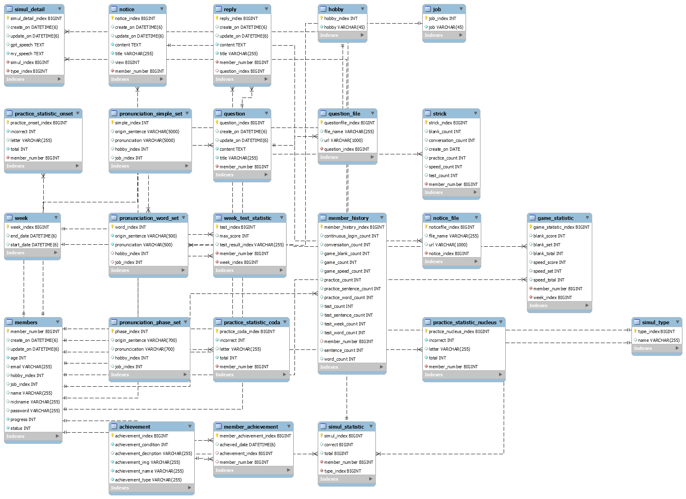

# readme

# 🌀 뇌질환 환자들의 재활 치료 프로젝트 내쉬다

> 개발 기간 : 2023.08.14 ~ 2023.10.06
> 개발 인원 : 6명
> 팀명 : 은공진응

## 📑 목차

1. 프로젝트 기획 배경
2. 주요기능 설명
3. 기술 스택
4. 아키텍처
5. ERD
6. 기능 엿보기
7. 팀원 소개 및 역할

## 🚩 프로젝트 기획 배경

> 후천적으로 실어증 혹은 말을 더듬는 후유증을 가진 분들을 위한 재활 프로젝트입니다.

후천적 실어증은 뇌질환으로 인한 휴유증으로 자주 발생하는 질병입니다.

언어재활은 조기 치료가 중요하며 초기 3개월에 가장 많이 회복되며 6개월 1년의 시간이 지날수록 회복 속도가 더뎌집니다.
하지만 현재 시행되고 있는 실어증 재활치료 현황은 사진이나 단어가 적힌 종이를 활용하여 환자에게 단어나 문장의 발음을 반복적으로 연습시킵니다.
이런 방식은 재활 치료사의 지속적인 지원이 필요하며, 시간적인 제약도 있습니다.
또한 각 환자의 재활 경과를 고려하여 자료를 조정할 수 있을 만큼 자료가 다양하지 않은 문제점이 있습니다.

저희는 이러한 문제점을 해결하고 실어증 환자들이 말을 쉼쉬는듯 편한하게 내쉴수 있도록 하고자 내쉬다를 기획하였습니다.

## 🔎 주요 기능 설명

### 1️⃣ 발음 연습을 위한 연습

- 단어, 단락, 단순절을 선택하여 난이도를 설정하여 발음 연습을 진행할 수 있습니다.
- 올바른 발음과 사용자의 말음을 문자로 비교하여 한눈에 확인할 수 있습니다.

### 2️⃣ 상황에 맞는 대화 연습

- chat gpt를 사용하여 실제 대화 상황처럼 대화를 할수 있습니다.
- 상황에 맞지 않는 답변은 저장이 되며 복습 가능합니다.
- 카페, 영화관, 경찰서 3가지 상황에서 연습 가능합니다.

### 3️⃣ 상황 인지 능력 향상을 위한 드라마플레이

- 한장의 사진을 보고 빈칸이 뚫린 문장을 채워 연습하는 게임입니다.
- 쉬움/중간/어려움 3단계로 사용자가 원하는 단계로 선택하여 게임을 진행할 수 있습니다.

### 4️⃣ 순간 인지 능력 향상을 위한 스피드게임

- 단어 하나와 4장의 사진을 본 후 단어에 맞는 사진을 빠르게 선택하는 게임입니다.
- 사용자는 순간인지능력 향상시킬수 있습니다.

### 5️⃣ 스트릭과 업적달성

- 스트릭 기능을 통해 최근 연습동향, 로그인 동향을 확인할 수 있습니다.
- 단어 10개 연습, 문장 10개 연습등의 업적을 달성하면 달성 날짜의 스트릭에 이모지가 뜹니다.

### 6️⃣ 주간 시험

- 드라마 플레이, 스피트게임, 연습 모두를 통합하여 주간 테스트를 진행할 수 있습니다.
- 주간 테스트의 결과를 통해 사용자들은 경과를 시각적으로 확인할 수 있습니다.

### 7️⃣ 통계

- 사용자가 많이 틀린 발음 순으로 통계를 나타냅니다.
- 주간시험을 다시 확인할 수 있으며 정답과, 자신의 발음을 다시 청취할 수 있습니다.
- 달성한 업적과 달성날짜를 한눈에 확인할 수 있습니다.
- 진행한 모든 게임에 대한 정보는 저장되며 확인 가능합니다.

## 🛠 기술스택

<table>
<tr>
 <td align="center">언어</td>
 <td>
  
  
	
	
 </td>
</tr>
<tr>
 <td align="center">프레임워크</td>
 <td>
  
	  
</tr>
<tr>
 <td align="center">라이브러리</td>
 <td>
  

</tr>
<tr>
 <td align="center">패키지 매니저</td>
 <td>
    
    

  </td>
</tr>
<tr>
 <td align="center">인프라</td>
 <td>
  
  
  
  
  
    
        
  
</tr>
<tr>
 <td align="center">포맷팅</td>
 <td>
   
   
   
  </td>
</tr>

<tr>
 <td align="center">협업툴</td>
 <td>
    
     
     
     
    
 </td>
</tr>
<tr>
 <td align="center">기타</td>
 <td>
    
     
    
        
 </td>
</tr>
</table>

## 🧱 아키텍쳐

## 📌 ERD

## 👀 기능엿보기
### 메인화면

### 🟣 로그인

### 🟣 비밀번호 찾기

### 🟣 회원가입

### 🟣 회원정보 수정

### 🟣 스피드게임

### 🟣 드라마플레이

### 🟣 주간 테스트

### 🟣 스트릭

### 🟣 관리자에게 문의

### 🟣 게임 통계

### 🟣 시뮬레이션 통계

### 🟣 업적

### 🟣 주간 테스트 통계

### 🟣 사용자 발음 통계

