# 내쉬다 배포
# 1. 개발 환경
### 1.1 Front-End
- Node.js 18.17.0
- React 18.2.0

### 1.2 Back-End
- openjdk 11 2018-09-25
- Spring Boot 2.7.16-SNAPSHOT
- Python 3.10.11
- Gradle 8.2.1
### 1.3  DB
- Redis 7.2.1
- MongoDB 7.0.1
- MySQL 8.1.0 

### 1.4 시스템
- Ubuntu 20.04.3
- Nginx 1.18.0
- Docker 24.0.6
- Jenkins 2.414.1

### 1.5 IDE
- IntelliJ IDEA 2023.1.3 (Ultimate Edition)
- Visual Studio Code

### 1.6 형상 / 이슈 관리
- Gitlab
- Jira
- Notion

### 그 외
- S3

# 2. 환경 변수
### Back-End
```yml
server:
  port: 8081
  servlet:
    context-path: /
    encoding:
      charset: UTF-8
      enabled: true
      force: true

spring:
  jackson:
    time-zone: Asia/Seoul
  data:
    mongodb:
      uri: mongodb://URL주소:27017/nashda?authSource=admin&authMechanism=SCRAM-SHA-1
  mail:
    host: smtp.gmail.com
    port: 587
    username: 이메일 주소
    password: 비밀번호
    properties:
      mail:
        smtp:
          auth: true
          starttls:
            enable: true
            required: true

  redis:
    host: URL 주소
    port: 6379
  session:
    timeout: 600
    store-type: redis
    redis:
      namespace: spring:session
      flush-mode: on-save

  servlet:
    multipart:
      max-file-size: 300MB
      max-request-size: 300MB
  datasource:
    #    url: jdbc:h2:tcp://localhost/~/nashda
    #    username: sa
    #    password:
    #    driver-class-name: org.h2.Driver

    #MySQL
    url: jdbc:mysql://URL주소:3306/DB명?serverTimezone=UTC&characterEncoding=UTF-8
    username: DB 유저 정보
    password: DB 비밀번호
    driver-class-name: com.mysql.cj.jdbc.Driver

  #    hikari:
  #      maximum-pool-size:1
  main:
    allow-circular-references: true

  profiles:
    include: db

  jpa:
    hibernate:
      ddl-auto: update
    properties:
      hibernate:
      #        show_sql: true
      # format_sql: true


jwt:
  issuer: 이메일
  secret: 시크릿 키

logging:
  level:
    org:
    # hibernate:
    #   type:
    #     descriptor:
    #       sql: debug


chatgpt:
  api-key: openai 키


cloud:
  aws:
    s3:
      bucket: nashda
    credentials:
      access-key: s3 access key
      secret-key: s3 secret key
    region:
      static: ap-northeast-2
      auto: false
    stack:
      auto: false


env:
  PROBLEM_URL: http://172.17.0.5:8082 # Docker 네트워크
  #PROBLEM_URL: http://localhost:8082

  STT_URL: http://172.17.0.6:8083 # Docker 네트워크
  #STT_URL: http://localhost:8000

```
# 3. EC2 설정
## 3.1 Docker 설치

1. 우분투 시스템 패키지 업데이트
```bash
sudo apt-get update
```
2. 필요한 패키지 설치
```bash
sudo apt-get install apt-transport-https ca-certificates curl gnupg-agent software-properties-common
```
3. Docker의 공식 GPG키를 추가
```bash
curl -fsSL https://download.docker.com/linux/ubuntu/gpg | sudo apt-key add -
```

4. Docker의 공식 apt 저장소를 추가
```bash
sudo add-apt-repository "deb [arch=amd64] https://download.docker.com/linux/ubuntu $(lsb_release -cs) stable"
 ```

5. 시스템 패키지 업데이트
```bash
sudo apt-get update
```
6. Docker 설치
```bash
sudo apt-get install docker-ce docker-ce-cli containerd.io
```

## 3.2 Nginx
1. Nginx 설치
```bash
sudo apt-get install nginx
```
2. Let's Encrypt 설치 및 SSL 발급
```bash
sudo apt-get install letsencrypt
sudo systemctl stop nginx
sudo letsencrypt certonly --standalone -d 도메인명

.... 이메일 입력 및 절차 진행
```
3. Nginx 설정 
```bash
cd /etc/nginx/sites-available
sudo nano default
```

```plaintext
# 설정 파일 변경
server {
	listen 443 ssl default_server;
	listen [::]:443 ssl default_server;

	
	ssl_certificate /etc/letsencrypt/live/도메인/fullchain.pem;
	ssl_certificate_key /etc/letsencrypt/live/도메인/privkey.pem;
	ssl_protocols TLSv1 TLSv1.1 TLSv1.2;
	ssl_ciphers HIGH:!aNULL:!MD5;
	
	root /home/ubuntu/nashda/build;

	index index.html index.htm index.nginx-debian.html;
	client_max_body_size 300M;
	server_name _;

	location / {
		try_files $uri /index.html;
	}

	location /test/ {
		proxy_pass http://127.0.0.1:8083/;
	}

	location /api/ {
		proxy_pass http://localhost:8081/;
	}
	

}

server {
	listen 80;
	listen [::]:80;
	
	server_name j9d105.p.ssafy.io;

	return 301 https://j9d105.p.ssafy.io;
}

```
4. nodejs 설치
```bash
sudo apt-get install -y curl
sudo apt update
sudo apt install nodejs
nodejs -v
sudo apt install npm
```

## MongoDB
1. MongoDB 이미지 받아오기
```bash
sudo docker pull mongodb
```
2. MongoDB 컨테이너 실행
```bash
docker run --name mongodb -v /data/db:/data/db -d -p 27017:27017 mongo --auth
```
3. MongoDB 설정
```bash
sudo docker exec -it mongodb /bin/bash
mongosh
use admin
db.createUser({ user: "nash", pwd: "d105nashda",  roles: ["root"] });
```
- auth 에러시 DB에 대한 권한 부여
```bash 
db.updateUser("nash", { roles : [{role :  "root", db : "admin"}, {role : "readWrite", db : "nashda"}]});
```

## 3.3 Jenkins
1. 젠킨스 설치
```bash
curl -fsSL https://pkg.jenkins.io/debian-stable/jenkins.io-2023.key | sudo tee \
  /usr/share/keyrings/jenkins-keyring.asc > /dev/null
echo deb [signed-by=/usr/share/keyrings/jenkins-keyring.asc] \
  https://pkg.jenkins.io/debian-stable binary/ | sudo tee \
  /etc/apt/sources.list.d/jenkins.list > /dev/null
sudo apt-get update
sudo apt-get install jenkins
```
- 인증 안되면 ca-certificates 설치 해보기
```bash
sudo apt install ca-certificates
```


## 3.4 redis
1. redis 이미지 받아오기
```bash
docker pull redis:alpine
```
2. redis 컨테이너 실행
``` bash
docker run -d -p 6379:6379 --name=redis redis:alpine
```

## 3.5 MySQL
1. MySQL 이미지 받아오기
```bash
docker pull mysql
```
2. MySQL 컨테이너 실행
``` bash
docker run -d -p 3306:3306 -e MYSQL_ROOT_PASSWORD=d105nashda --name mysql mysql:latest --character-set-server=utf8mb4 --collation-server=utf8mb4_unicode_ci
```
3. MySQL 유저 설정
```bash
sudo docker exec -it mysql /bin/bash
mysql -u root -p
# 비밀번호 입력

# 유저 생성
create user 'nash'@'%' identified by 'd105nashda';

# 권한 부여
grant all privileges on *.* to 'nash'@'%';
flush privileges;
```


## 3.6 포트 번호
|포트 번호|내용|
|------|-------|
|80|HTTP|
|443|HTTPS|
|8080|Jenkins|
|8081|Spring 인증 서버|
|8082|Spring 문제 서버|
|8083|STT 서버|
|6379|Redis|
|3306|MySQL|
|27017|MongoDB|

## 3.7 S3 설정
1. 관리 콘솔에 로그인 후 S3 접속
  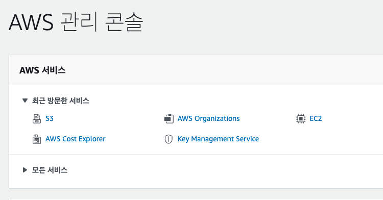

2. 우측의 버킷 만들기 클릭
  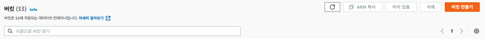

3. 이름, 리전 설정
  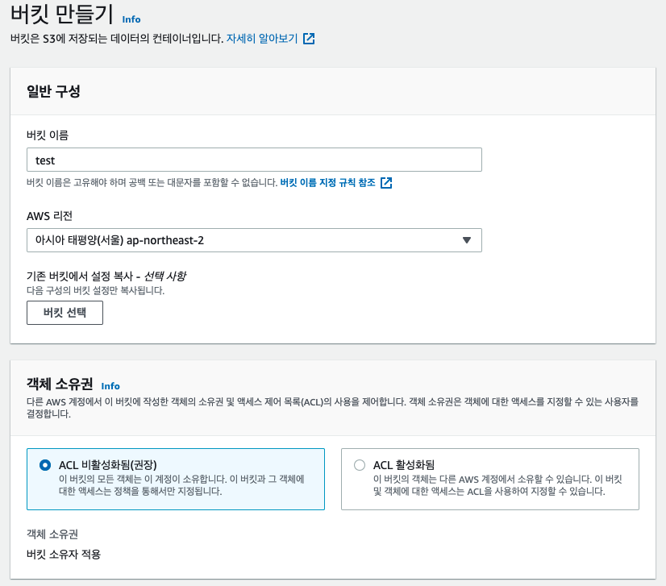

4. 퍼블릭 설정
  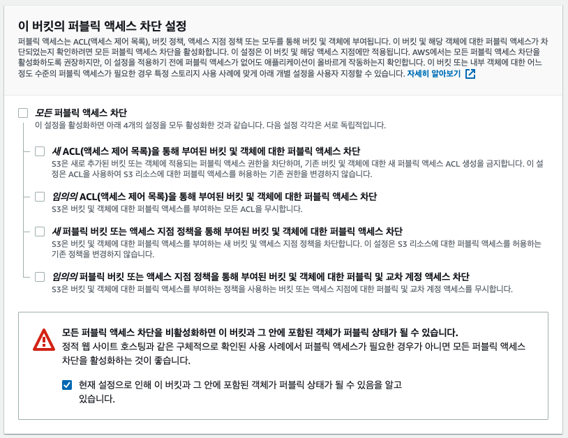

5. 버킷 만들기
  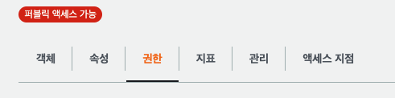

6. 버킷 정책 만들기
  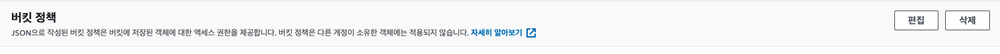
    ```
    {
      "Version": "2012-10-17",
      "Id": "Policy1695907050555",
      "Statement": [
          {
              "Sid": "Stmt1695907005761",
              "Effect": "Allow",
              "Principal": "*",
              "Action": "s3:*",
              "Resource": "arn:aws:s3:::nashda/*"
          }
      ]
    }
    ```


## 3.8 SMTP 설정
- 

## 3.9 ChatGPT 설정
- OpenAI 로그인 후 https://platform.openai.com/account/api-keys에 접속
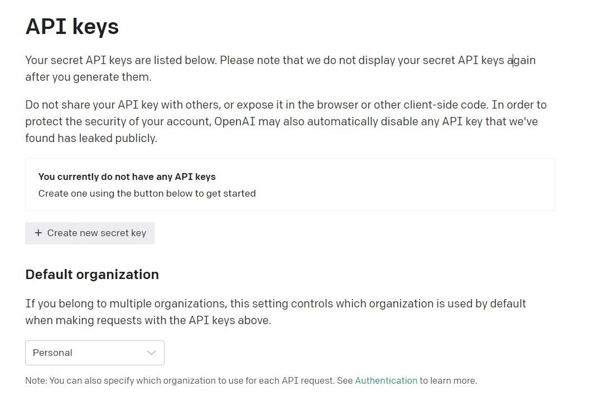

- create new secret key를 눌러 키 생성
- 사용할 만큼 credit을 충전
- 이 키값을 spring 설정파일에 적용

## 4. 백엔드 배포
- Jenkins 페이지 진입
  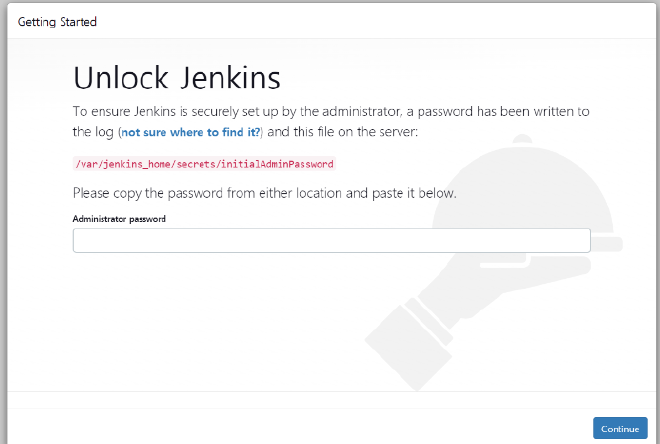
  `초기 비밀번호의 경우 /var/jenkins_home/secrets/initialAdminPassword 에 있음`
  
- Plugin 전부 설치
  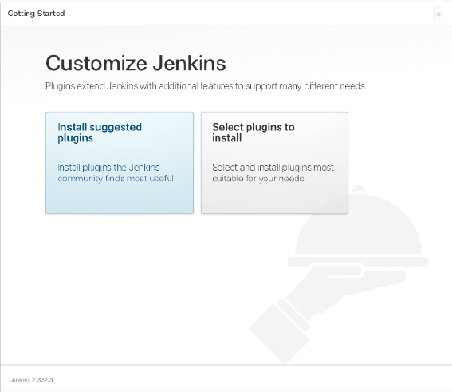

- 계정을 생성
  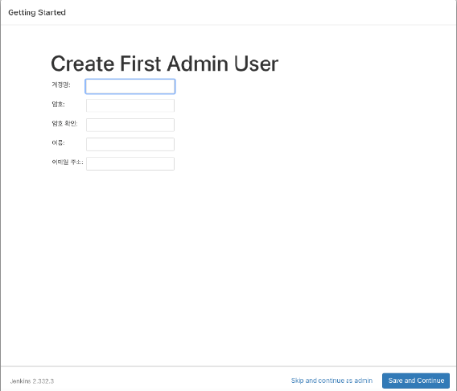

- gitlab을 사용 시 gitlab을 연결하기 위한 토큰을 생성
  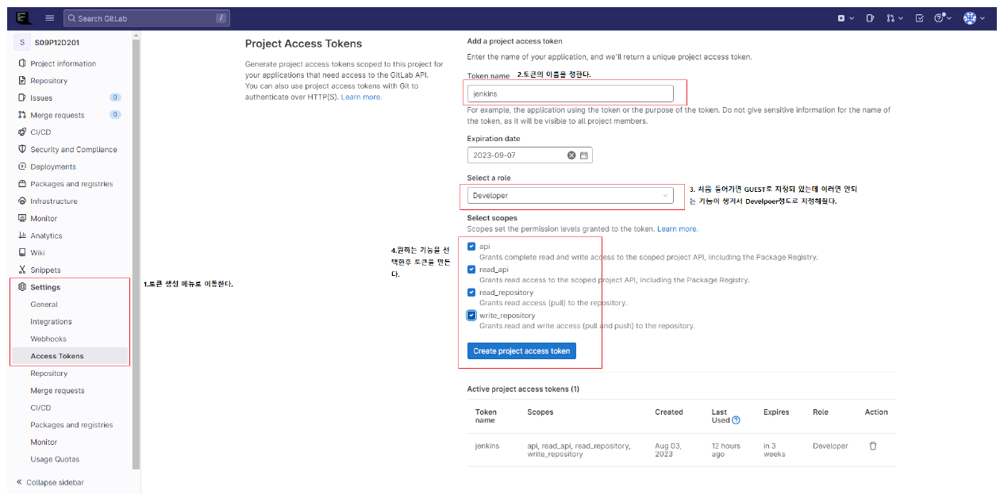

- plugins에 들어가서 available plugins에 들어가 gitlab과 ssh agent, docker를 설치
  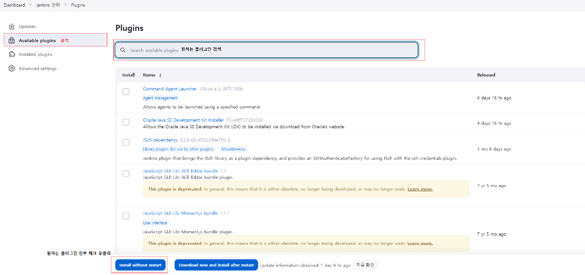
 
- 젠킨스에 접속해서 로그인 후 jenkins관리로 이동 후 Credentials를 클릭
  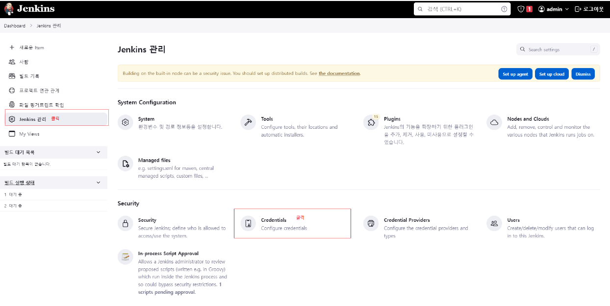

- 새로운 Credentials를 만들어 준다
  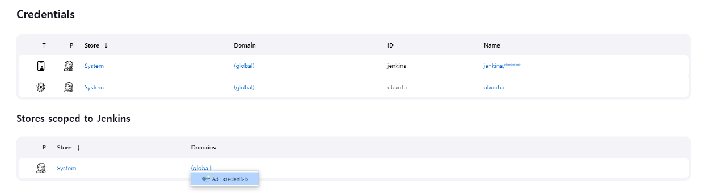

- 발급 받은 토큰을 jenkins에 등록
  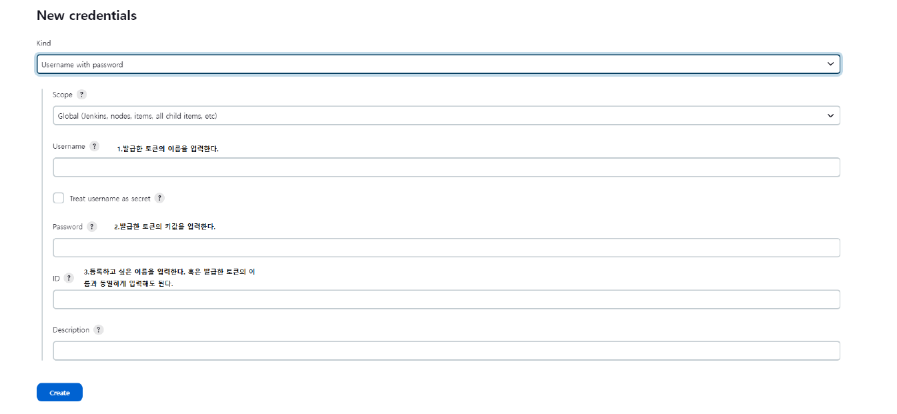

- 이제 메인 페이지에서 새로운 item을 클릭하고 pipeline을 선택 후 원하는 이름으로 설정
- 구성의 소스코드 관리로 이동하여 git을 클릭하고 git 주소, 등록한 git토큰 배포할 브런치를 선택한다
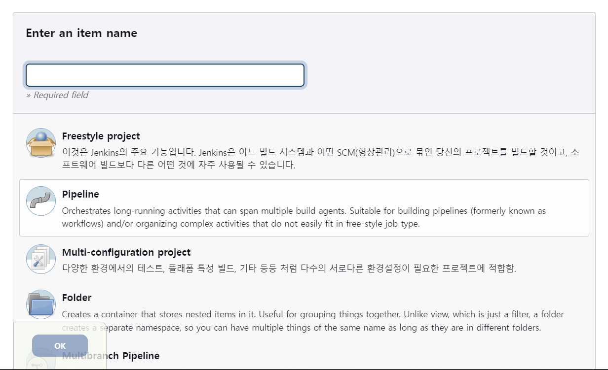
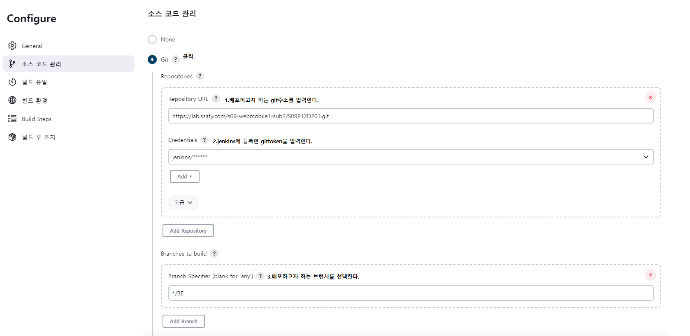

- 빌드 유발로 이동하여 webhook설정 (선택)
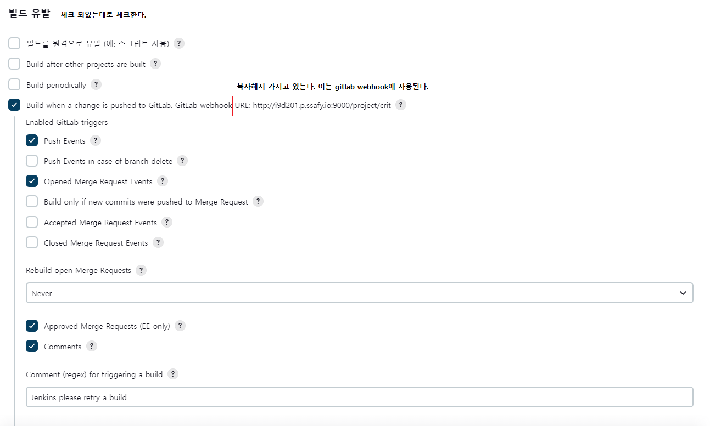
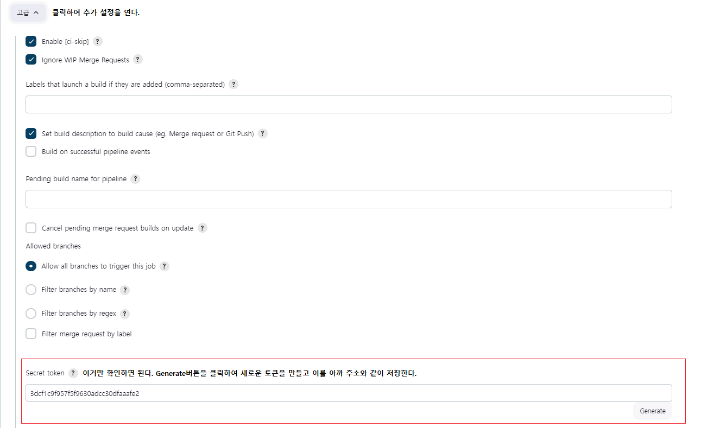

- gitlab에서 webhook을 등록하고 jenkins 와 연결
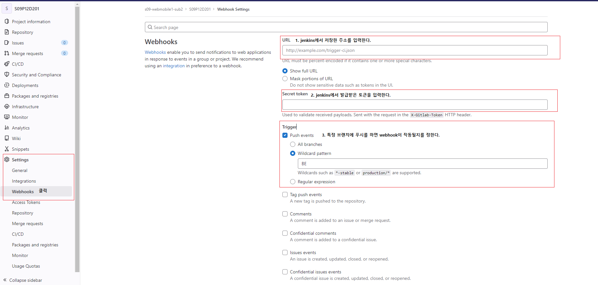

- 등록을 하면 밑에 나타나게 되는데 Test - push events를 클릭하면 테스트가 진행되고 위에 결과가 http 200이면 연결 성공
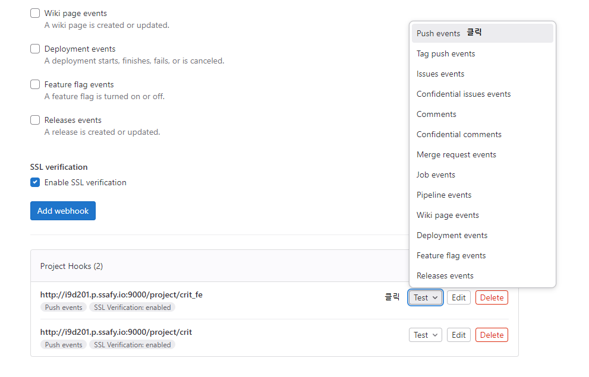

- pipeline으로 이동하여 pipeline script를 클릭하여 다음과 같은 코드를 입력
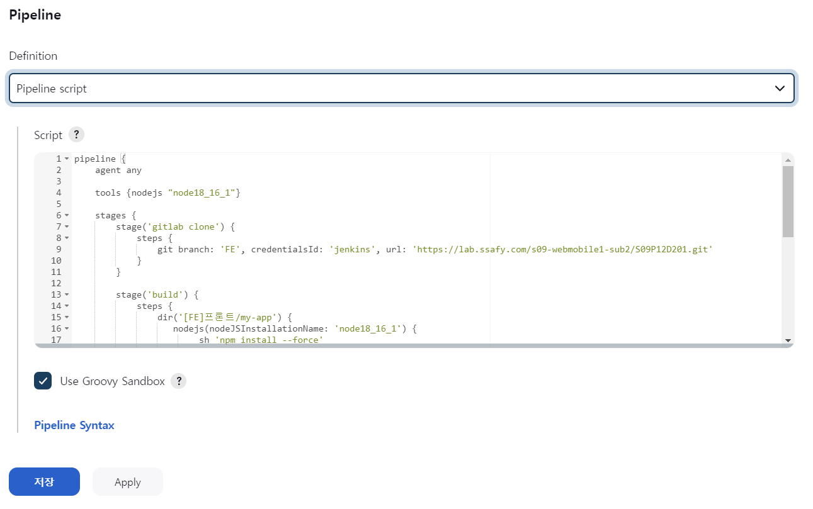
```bash
pipeline {
    agent {
        any {
            // 젠킨스에서 사용할 Docker 이미지 설정
            // 여기서는 Gradle과 Java가 설치된 이미지를 사용합니다.
            image 'gradle:jdk11'
        }
    }

    environment {
        // 빌드 결과물이 저장될 경로
        BUILD_DIR = "/var/nashda/backend/backend"
        DOCKER_CONTAINER_NAME_1 = "nashda_be"
        DOCKER_CONTAINER_NAME_2 = "nashda_be_problem"
        DOCKER_CONTAINER_NAME_3 = "nashda_stt"
    }

    stages {

        stage('Git Clone') {
            steps {
                git branch: 'develop',
                credentialsId: 'jenkins',
                url: 'https://lab.ssafy.com/s09-ai-speech-sub2/S09P22D105'
            }
        }
        
        stage('Build 1') {
            steps {
                sh 'pwd'
                sh 'ls -al'
                
                // jar 파일 삭제
                sh 'rm build/libs/*.jar | true'
                
                dir('backend/authentication-integration-service'){
                    // 스프링 빌드
                    sh 'pwd'
                    sh 'ls -al'
                    sh 'chmod +x gradlew'
                    sh './gradlew clean build'
                    
                    // 도커 이미지 빌드
                    sh 'docker build -t nashda_be .'
                    
                    sh 'docker images'
                }
            }
        }

        stage('Build 2') {
            steps {
                sh 'pwd'
                sh 'ls -al'
                
                // jar 파일 삭제
                sh 'rm build/libs/*.jar | true'
                
                dir('backend/nashda-problem'){
                    // 스프링 빌드
                    sh 'pwd'
                    sh 'ls -al'
                    sh 'chmod +x gradlew'
                    sh './gradlew clean build'
                    
                    // 도커 이미지 빌드
                    sh 'docker build -t nashda_be_problem .'
                    
                    sh 'docker images'
                }
            }
        }
        
        stage('Build 3') {
            steps {
                sh 'pwd'
                sh 'ls -al'
                
                dir('backend/nashda-stt'){
                    sh 'pwd'
                    sh 'ls -al'
                    
                    // 도커 이미지 빌드
                    sh 'docker build -t nashda_stt .'
                    sh 'docker images'
                }
            }
        }

        stage('Deploy') {
            steps {
                // 기존 서버 중지
                sh "docker stop $DOCKER_CONTAINER_NAME_1 || true"  // 기존 컨테이너가 없을 경우를 위해 무시
                sh "docker rm $DOCKER_CONTAINER_NAME_1 || true"    // 기존 컨테이너가 없을 경우를 위해 무시
                sh "docker stop $DOCKER_CONTAINER_NAME_2 || true"  // 기존 컨테이너가 없을 경우를 위해 무시
                sh "docker rm $DOCKER_CONTAINER_NAME_2 || true"    // 기존 컨테이너가 없을 경우를 위해 무시 
                sh "docker stop $DOCKER_CONTAINER_NAME_3 || true"  // 기존 컨테이너가 없을 경우를 위해 무시
                sh "docker rm $DOCKER_CONTAINER_NAME_3 || true"    // 기존 컨테이너가 없을 경우를 위해 무시


                // 빌드된 파일을 원하는 위치로 배포
                // 예: 서버에 배포하는 경우
                sh "whoami"
                sh "groups"
                
                // 쓰레기 이미지 삭제
                sh 'docker images -f "dangling=true" -q | xargs docker rmi'
                // 새로운 서버 실행
                sh "docker run -d -p 8081:8081 -e TZ=Asia/Seoul --name $DOCKER_CONTAINER_NAME_1 nashda_be"
                sh "docker run -d -p 8082:8082 -e TZ=Asia/Seoul --name $DOCKER_CONTAINER_NAME_2 nashda_be_problem"	
                sh "docker run -d -p 8083:8083 -e TZ=Asia/Seoul --name $DOCKER_CONTAINER_NAME_3 nashda_stt"	
            }
        }
    }
}
```
- webhook으로 자동 빌드 되거나 지금 빌드 버튼을 눌러 배포가 가능

## 5. 프론트 배포
- jenkins에 들어가서 jenkins관리 → plugin에서 nodejs를 설치
- tool에서 현재 ubuntu에 설치되어있는 node버전과 동일하게 추가
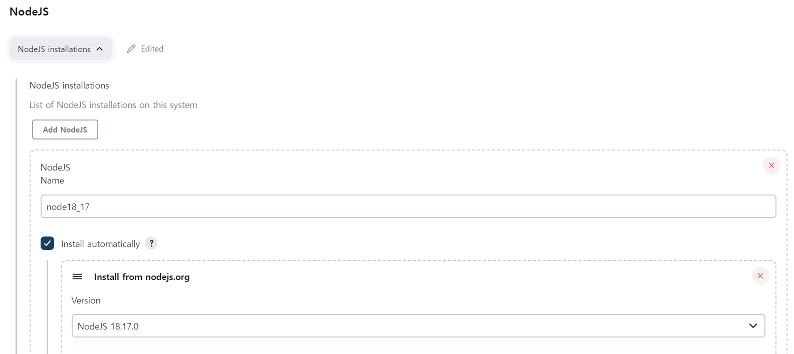

- 백엔드와 동일하게 Webhook 설정

- 파이프라인 작성

```bash
pipeline {
    agent any
    
    tools {nodejs "nodejs_18_17_0"}

    stages {
        stage('Git Clone') {
            steps {
                git branch: 'develop',
                credentialsId: 'jenkins',
                url: 'https://lab.ssafy.com/s09-ai-speech-sub2/S09P22D105'
            }
        }
        
        stage('Build') {
            steps {
                dir('frontend'){
                    nodejs(nodeJSInstallationName: 'nodejs_18_17_0'){
                        sh 'npm install'
                        sh 'npm run build'
                    }
                    sh 'pwd'
                    sh 'sudo cp -rf build /home/ubuntu/nashda'
                }
            }
        }

    }
}
```

## 인공지능
- 
